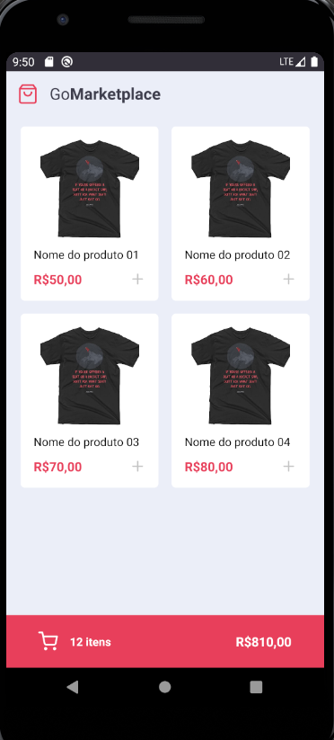
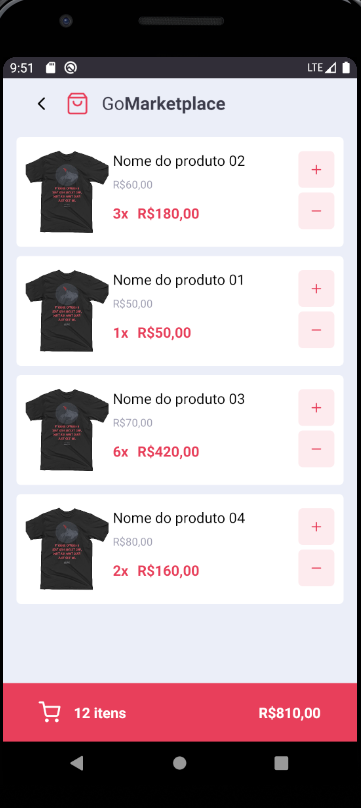

<h3 align="center">
  Desafio 08: Fundamentos do React Native
</h3>

## :rocket: Sobre o desafio

Nesse desafio, usando TypeScript, React Navigation, Async Storage e a Context API foi aplicado os conceitos do React Native e foi desenvolvido a aplicação GoMarketPlace, um Carrinho de Pedidos onde você pode adicionar produtos ao carrinho, aumentar ou diminuir a quantidade de produtos e ver o total de itens/valor dos produtos.

Telas da aplicação:

    
    

